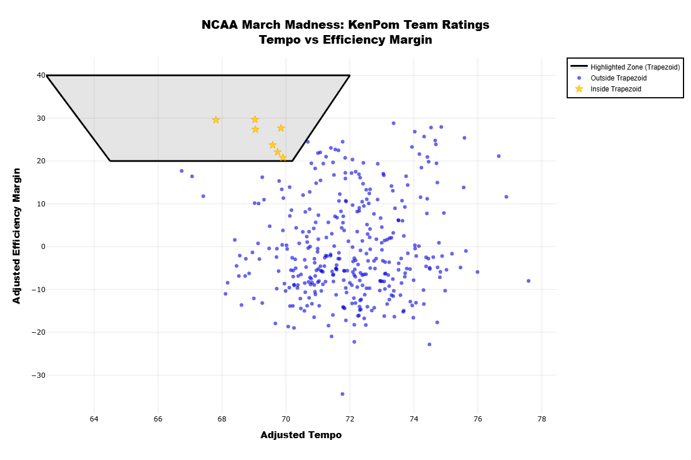

# KenPom Team Ratings Visualization

Interactive visualization of NCAA basketball team ratings using KenPom data.

## 📊 Visualization

Click the link above to explore the interactive Plotly visualization with:
- **Yellow Stars** ⭐ - Teams inside the highlighted zone
- **Blue Dots** 🔵 - All other teams
- Teams Inside The "Trapezoid of Excellence" are believed to do well in March
- Hover over points to see team details
- Zoom, pan, and interact with the chart

## 🎯 About

This project visualizes NCAA March Madness team ratings based on:
- **Adjusted Tempo** (x-axis) - Possessions per game
- **Adjusted Efficiency Margin** (y-axis) - Overall team rating

The trapezoid highlights teams with optimal tempo and efficiency combinations.

